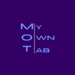
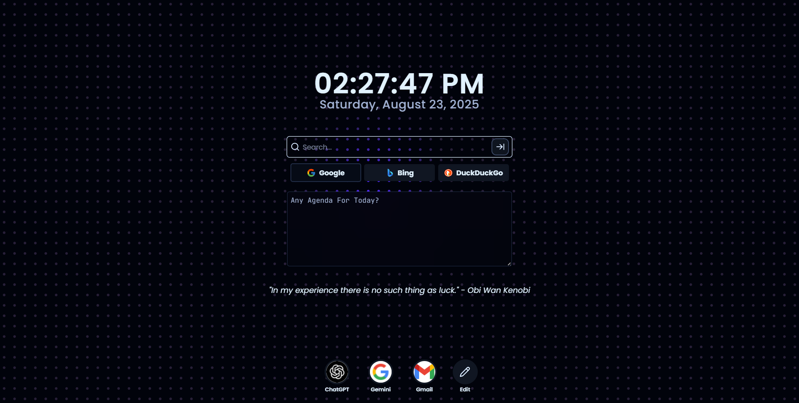
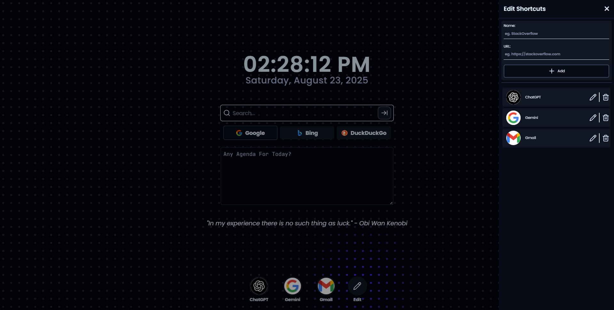

<div align="center">
  
  
  # MyOwnTab
  
  **A Minimal & Productive Chrome New Tab Extension**
  
  [](https://github.com/tanmay-bhatgare/my-own-tab)
  [](LICENSE)
  [](https://chrome.google.com/webstore)
  
  *Replace your boring Chrome new tab with a **dark-themed, developer-friendly dashboard** featuring quotes, a clock, shortcuts, and full state management.*
</div>

---

## ✨ Features

- 🎨 **Minimal Dark Theme** – Designed to reduce eye strain and keep things clean
- 🕒 **Digital Clock** – Stay on top of time, styled for dev vibes
- 💬 **Random Quotes** – Get fresh inspiration every time you open a new tab
- ⚡ **Shortcuts Panel** – Add, edit, and delete your favorite links
- 🔄 **State Management** – All changes persist, your setup stays exactly how you like it
- 🚀 **Lightweight** – Fast loading with minimal resource usage

---

## 📸 Screenshots

<div align="center">
  
  <br/>
  <em>Full Interface View</em>
  <br/><br/>
  
  
  <br/>
  <em>Shortcuts Sidebar</em>
</div>

---

## 🛠️ Development Setup

### Prerequisites

- Node.js (v16 or higher)
- pnpm (recommended) or npm

### Getting Started

1. **Clone the repository**

   ```bash
   git clone https://github.com/tanmay-bhatgare/my-own-tab.git
   cd my-own-tab
   ```

2. **Install dependencies**

   ```bash
   pnpm install
   # or
   npm install
   ```

3. **Start development server**
   ```bash
   pnpm dev
   # or
   npm run dev
   ```

---

## 🚀 Installation Guide

### Method 1: Manual Installation (Developer Mode)

1. **Build the extension**

   ```bash
   git clone https://github.com/tanmay-bhatgare/my-own-tab.git
   cd my-own-tab
   pnpm install
   pnpm build
   ```

2. **Load in Chrome**
   - Open Chrome and navigate to `chrome://extensions/`
   - Enable **Developer mode** (toggle in top-right corner)
   - Click **Load unpacked**
   - Select the `dist` folder from your project directory
   - Done! ✅

### Method 2: Edge Installation

- Navigate to `edge://extensions/`
- Follow the same steps as Chrome installation

---

## 🎯 Usage

1. **Clock Display** - Shows current time prominently
2. **Inspirational Quotes** - Refresh for new motivation
3. **Quick Shortcuts** - Click the sidebar to manage your favorite links
4. **Persistent Settings** - Your customizations are automatically saved

---

## 🤝 Contributing

We welcome contributions! Here's how you can help:

1. Fork the repository
2. Create a feature branch (`git checkout -b feature/amazing-feature`)
3. Commit your changes (`git commit -m 'Add some amazing feature'`)
4. Push to the branch (`git push origin feature/amazing-feature`)
5. Open a Pull Request

---

## 📝 License

This project is licensed under the MIT License - see the [LICENSE](LICENSE) file for details.

---

## 🙏 Acknowledgments

- Thanks to all contributors who help improve this extension
- Inspired by the need for a cleaner, more productive new tab experience
- Built with modern web technologies for optimal performance

---

## 📞 Support

- 🐛 **Bug Reports**: [GitHub Issues](https://github.com/tanmay-bhatgare/my-own-tab/issues)
- 💡 **Feature Requests**: [GitHub Discussions](https://github.com/tanmay-bhatgare/my-own-tab/discussions)

---

<div align="center">
  <strong>⭐ Don't forget to star this repo if you found it helpful!</strong>
  <br/><br/>
  Made with ❤️ by <a href="https://github.com/tanmay-bhatgare">Tanmay Bhatgare</a>
</div>
